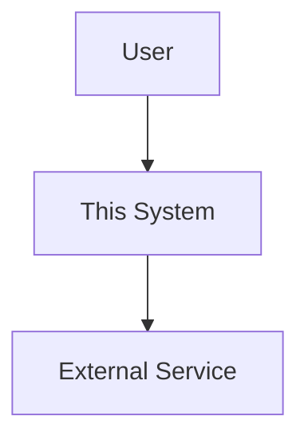
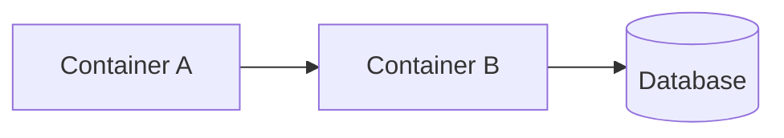
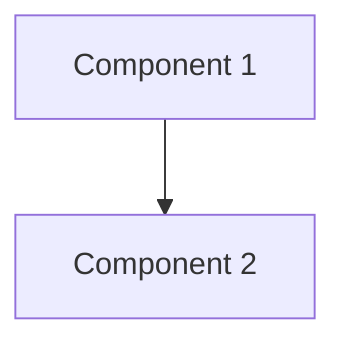

# ARCHITECTURE: {{goal}}

## Related Links

- SPEC: (link or `see: .agents/sessions/<spec-file>`)
- Design: (link or `see: .agents/sessions/<design-file>`)

## Context

- System context, constraints, non-functional requirements

## Architecture Overview (C4 Level 1 — Context)

## Container Diagram (C4 Level 2)

## Component Diagram (C4 Level 3)

## Decisions

- Decision 1 — why
- Decision 2 — why

## Trade-offs

- Trade-off 1
- Trade-off 2

## Deployment

- How this system deploys (diagrams, scripts, environments)

## Notes

- Tech debt, migration paths, scaling considerations
