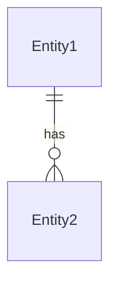
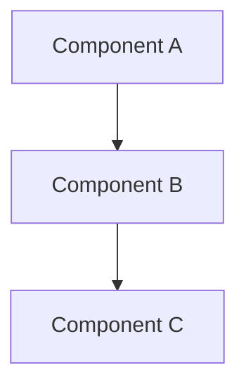

# DESIGN: {{goal}}

## Related Links

- SPEC: (link or `see: .agents/sessions/<spec-file>`)
- Plan: (link or `see: .agents/sessions/<plan-file>`)
- Figma/mockup/prototype: (if applicable)

## Overview

- What is being designed and why
- User-facing impact (if any)

## Components

- Component 1 — responsibility, interface
- Component 2 — responsibility, interface

## Data Model

- Entities, relationships (include Mermaid ER diagram if helpful)

## APIs

- Endpoint/function signatures, request/response shapes

## Diagrams

## Test Strategy

- How to verify this design works
- Conformance criteria reference

## Notes

- Edge cases, trade-offs, alternatives considered
